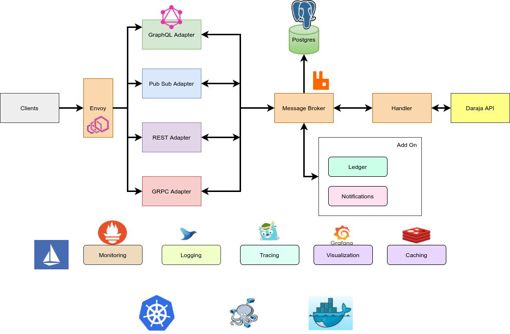

# MpesaOverlay

MpesaOverlay is modern, scalable, secure open source and patent-free API overlay for the Daraja API by Safaricom written in Go.

It accepts connections over various API (i.e. REST, GRPC, Pub/Sub), thus making a seamless bridge between the client and the Daraja API. It is used as a middleware for building complex Payments solutions.

## Features

- Interface bridging (i.e. REST, GRPC, Pub/Sub)
- CLI for managing the platform
- Platform logging and instrumentation support
- Container-based deployment using Docker

Upcoming features:

- Ledger support. The platform should be able to store transactions in a ledger.
- Clusterization. The platform should be able to run in a cluster of nodes for high availability and scalability.
- Analytics and reporting. The should provide a way for developers to generate reports on their Mpesa transactions.
- Event sourcing support
- SDKs for various programming languages
- Documentation: The API should have comprehensive and up-to-date documentation.

## Architecture

### Components

MpesaOverlay platform is comprised of the following services:

- rest-adapter Provides a REST interface for accessing communication channels
- grpc-adapter Provides a gRPC interface for accessing communication channels
- pubsub-adapter Provides a Pub/Sub interface for accessing communication channels
- mpesa-cli Command line interface

