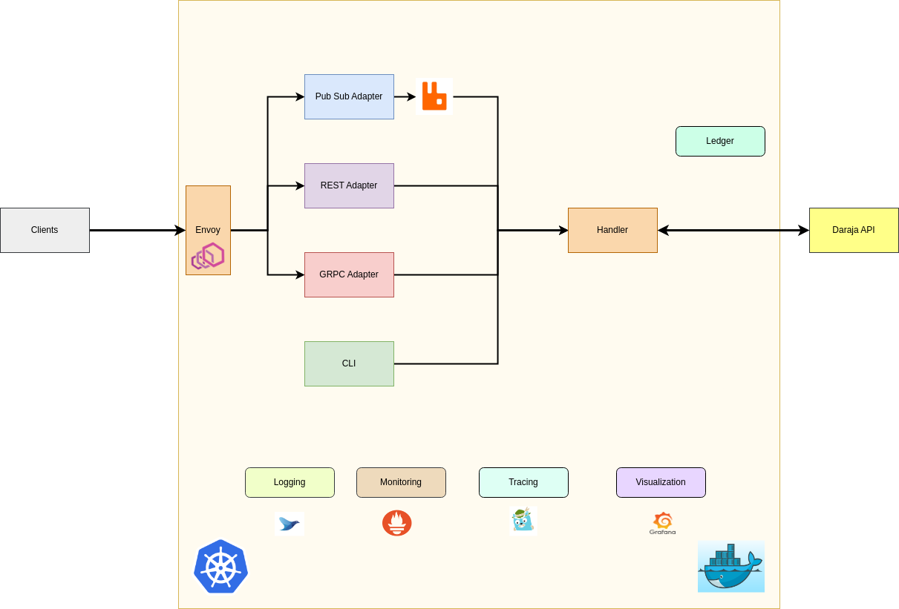

MpesaOverlay is modern, scalable, secure open source and patent-free API overlay for the Daraja API by Safaricom written in Go.

It accepts connections over various API (i.e. REST, GRPC, Pub/Sub), thus making a seamless bridge between the different client and the Daraja API. It is used as a middleware for building complex Payments solutions.

## Features

- Interface bridging (i.e. REST, GRPC, Pub/Sub)
- CLI for managing the platform
- Platform logging and instrumentation support
- Container-based deployment using Docker
- Documentation: The API should have comprehensive and up-to-date documentation.

### Upcoming features:

- Ledger support. The platform should be able to store transactions in a ledger.
- Clusterization. The platform should be able to run in a cluster of nodes for high availability and scalability.
- Analytics and reporting. The should provide a way for developers to generate reports on their Mpesa transactions.
- Event sourcing support
- SDKs for various programming languages

## Different Adapters

MpesaOverlay platform is comprised of the following services:

- [rest-adapter](./essentials/rest) Provides a REST interface for accessing communication channels
- [grpc-adapter](./essentials/grpc) Provides a gRPC interface for accessing communication channels
- [pubsub-adapter](./essentials/pubsub) Provides a Pub/Sub interface for accessing communication channels
- [mpesa-cli](./essentials/cli) Command line interface

With mpesaoverlay you can access mpesa accross different adapters. You can use mpesaoverlay with the following adapters:

<CardGroup cols={2}>
  <Card title="MQTT Adapter" icon="m" href="./essentials/mqtt">
    Use MQTT to send and receive messages to and from your Mpesa API
  </Card>
  <Card title="GRPC Adapter" icon="webhook" href="./essentials/grpc">
    Use GRPC to communicate with your Mpesa API
  </Card>
  <Card title="CLI Adapter" icon="terminal" href="./essentials/cli">
    Use the CLI to communicate with your Mpesa API
  </Card>
</CardGroup>

## Contributing

We are always looking for people to help us improve this documentation and better understand how you use mpesaoverlay. Whether you’re a first-time user or a seasoned veteran, we’d love to hear your feedback.

You can contribute to this documentation on [Github](https://github.com/0x6flab/mpesaoverlay).
