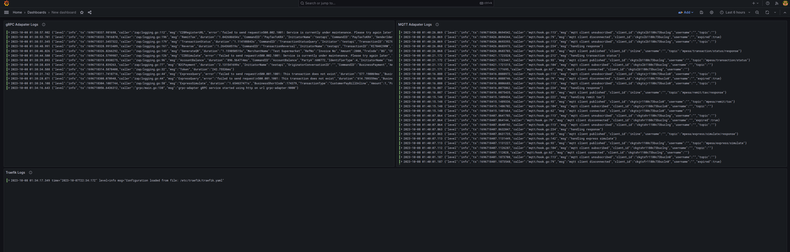
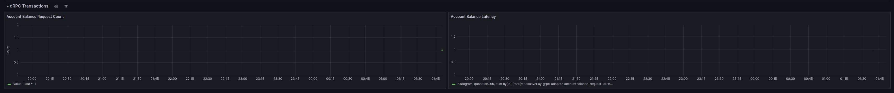

The MpesaOverlay platform is a middleware solution that sits between your application and the Daraja API.
It provides a unified interface for accessing the Daraja API, regardless of whether you are using a REST, gRPC, or Pub/Sub interface.

The platform also provides a number of other features, such as:

1. Logging and instrumentation support: The platform logs all requests and responses to the Daraja API, making it easy to troubleshoot problems.
   It also provides a number of metrics that can be used to monitor the performance of your application.
2. Container-based deployment: The platform can be deployed in a containerized environment using Docker.
   This makes it easy to scale your application up or down as needed.
3. Comprehensive documentation: The platform is well-documented, with a comprehensive API reference and tutorials.

The architecture of MpesaOverlay incorporates different components and features to ensure smooth operation and robust functionality.
One crucial aspect is the monitoring and observability infrastructure, which includes the Loki stack for logs and Prometheus for metrics.

## Loki Stack for Logs

Loki is a distributed system, part of the Grafana Labs stack, designed for log aggregation, querying, and storage.
MpesaOverlay leverages Loki to efficiently handle logs generated by its components. The Loki stack typically consists of the following components:

1. Loki: The main server responsible for receiving logs, indexing them, and making them queryable.
2. Promtail: An agent that ships the logs from the MpesaOverlay platform to Loki.
3. Grafana: A platform used for querying and visualizing logs stored in Loki.

MpesaOverlay utilizes Loki to collect logs from various parts of the system,
including the different adapters (REST, gRPC, Pub/Sub), and other essential services.
This allows for centralized log storage and efficient querying, making it easier to monitor and troubleshoot the platform.

<Frame type="glass" caption="Logs from protocol adapters">
  
</Frame>

## Prometheus for Metrics

Prometheus is an open-source monitoring and alerting toolkit designed for reliability and scalability.
It is used for recording real-time metrics, performing queries, and generating alerts based on predefined rules.
In the context of MpesaOverlay, Prometheus is utilized to collect and store various metrics related to the platform's performance and behavior.

MpesaOverlay instruments its code to expose metrics related to adapter performance, transaction processing, system resource usage, and more.
Prometheus scrapes these metrics at regular intervals, storing them in a time-series database.
This data can then be visualized using Grafana or any other compatible visualization tool.

<Frame type="glass" caption="metrics from gRPC adapter">
  
</Frame>
